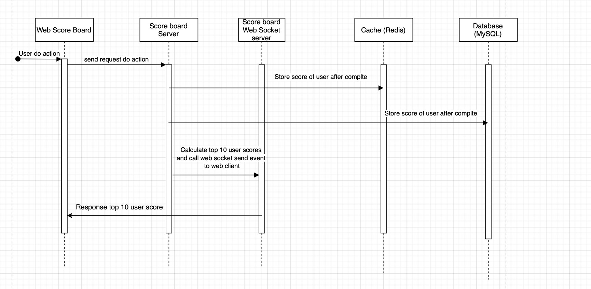
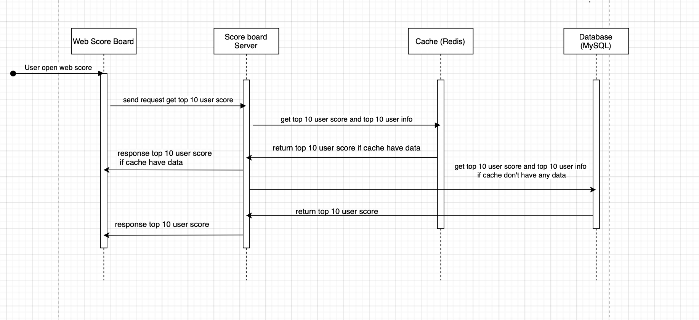

## Flow user complete action to increase score

1. When user to do action, web client sends a request to the Score board server

2. Server handle complete action

3. Server calculate new  user score and store to database

4. Server recalculate top 10 user score and store to cache service

5. Server call web socket service to get latest top 10 user score

6. Web socket send the event to web client to re-render new top 10 user score

## Flow user open web score board and view top 10 user score

1. When user open the web score board , web client sends a request to the Score board server

2. Server handle get top 10 user score

3. Server send request to cache service to get top 10 user score 

4. If data on cache service exist server will send to the client the data

5. Otherwise Server  send request to database to get top 10 user score 

5. Server send to the client the data.

## Redis solutions
We will use data type Sorted Set in Redis that store leaderboard user. Every have request get top 10 user score, the server can get data quickly by redis that without needing to fall back on complex DB queries.

## Prevent malicious users from increasing scores without authorisation solutions
We should set the limit action of user in range time